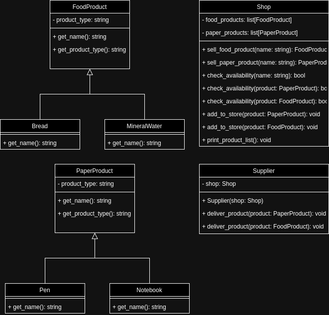

# pjf-lab2-b
Na podstawie ponizszego diagramu UML zaimplementuj klasy:
- PaperProduct
- FoodProduct
- Shop 
- Supplier 
- Notebook 
- Bread 
- Pen 
- MineralWater

Modifikuj wyłącznie plik `solution.py`.



## UWAGA
Diagram był pierwotnie zadaniem w CPP. Python nie dostarcza wszystkich mechnizmów, które sa wykorzystane w tym diagramie, dlatego nie ma można trzymać sie "ściśle" diagramu.

### Testy jednostkowe
Testy nie są podzielone. Całość za 30pkt. Aby uruchomić testy, wpisz w terminalu:
```bash
pytest
```
